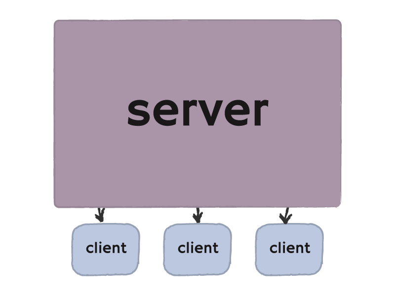
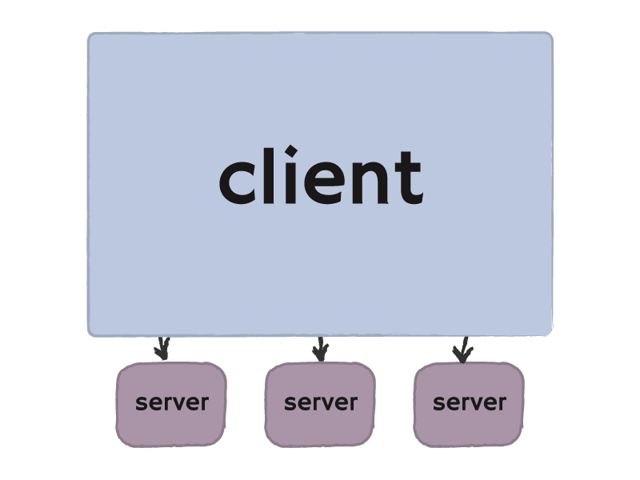
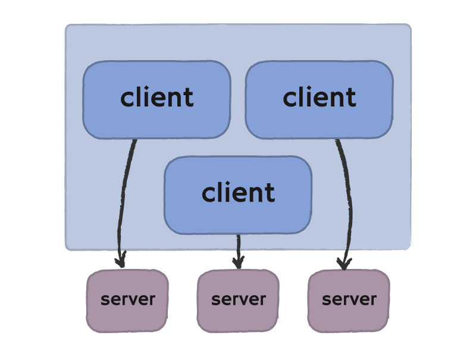
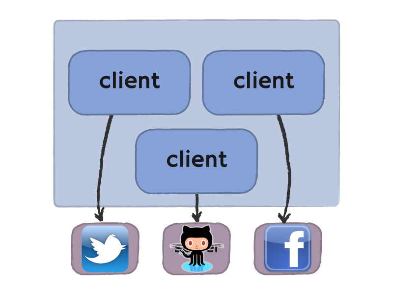
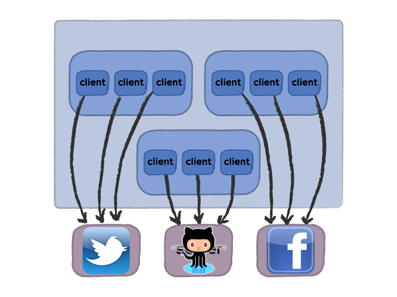
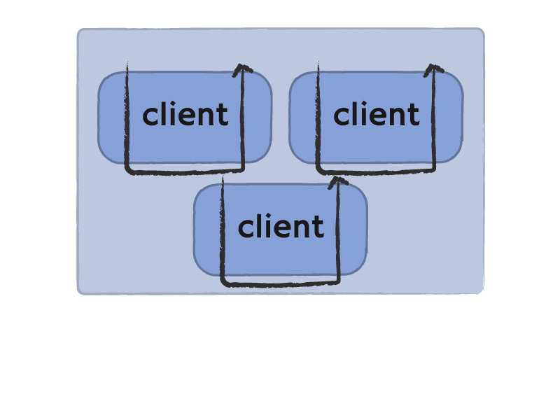
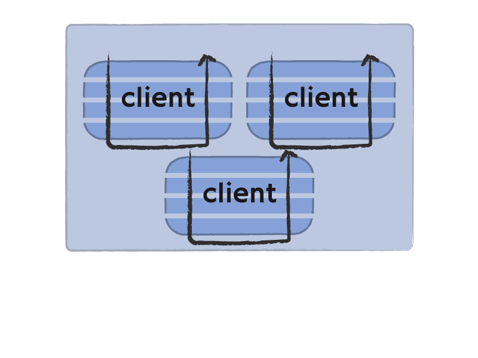
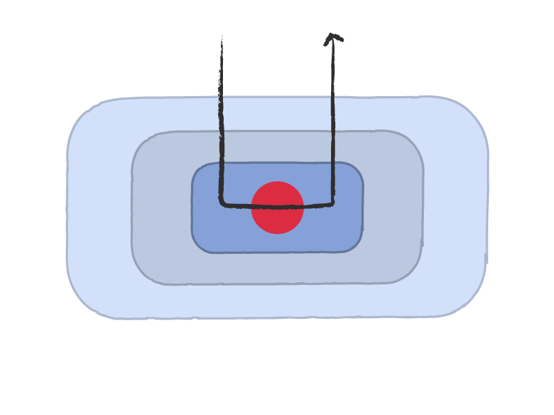

# rest-core A modular Ruby REST client collection/infrastructure 

---

# [http://godfat.org/slide /2011-08-27-rest-core.html](http://godfat.org/slide/2011-08-27-rest-core.html)

---

#  Lin Jen-Shin ([godfat][])

 

* Programmer at [Cardinal Blue][]
* Programming Language
* Functional Programming (Haskell)
* Ruby

[Cardinal Blue]: http://cardinalblue.com/
[godfat]: http://godfat.org/

---

 

* Quick Example

---

 

* Quick Example
* Rack

---

 

* Quick Example
* Rack
* Difference from Rack

---

 

* Quick Example
* Rack
* Difference from Rack
* Architecture

---

---

---

# [][soapbox]

[soapbox]: http://www.quixoticpixels.com/blog/2011/06/soap-box/

---

# REST 

---

# Solution: [rest-core][]

[rest-core]: https://github.com/cardinalblue/rest-core

---

# Inspired by [faraday][] and [Rack][]

[faraday]: https://github.com/technoweenie/faraday
[Rack]: https://github.com/rack/rack

---

    !ruby

      Github = RestCore::Builder.client do
      end

---

    !ruby

      Github = RestCore::Builder.client do
      ♨
      ♨
      ♨
      end
      ♨
      ♨

---

    !ruby

      Github = RestCore::Builder.client do
        use DefaultSite , 'https://api.github.com/users/'
      ♨
      ♨
      end
      ♨
      ♨

---

    !ruby

      Github = RestCore::Builder.client do
        use DefaultSite , 'https://api.github.com/users/'
        use JsonDecode  , true
      ♨
      end
      ♨
      ♨

---

    !ruby

      Github = RestCore::Builder.client do
        use DefaultSite , 'https://api.github.com/users/'
        use JsonDecode  , true
        run RestClient
      end
      ♨
      ♨

---

    !ruby

      Github = RestCore::Builder.client do
        use DefaultSite , 'https://api.github.com/users/'
        use JsonDecode  , true
        run RestClient
      end
      ♨
      Github.new.get('godfat')

---

    !ruby

      Github = RestCore::Builder.client do
        use DefaultSite , 'https://api.github.com/users/'
        use JsonDecode  , true
        run RestClient
      end
      ♨
      Github.new.get('godfat')
      ♨
      {"type"=>"User","company"=>"cardinalblue",
       "blog"=>"http://godfat.org","hireable"=>false,
       "url"=>"https://api.github.com/users/godfat",
       "followers"=>40,"html_url"=>"https://github.com/godfat",
       "bio"=>nil,"created_at"=>"2008-05-15T18:33:24Z",
       "avatar_url"=>"https://...","following"=>33,
       "name"=>"Lin Jen-Shin (godfat)","location"=>"Taiwan",
       "email"=>"godfat (XD) godfat.org","public_repos"=>62,
       "id"=>10416,"login"=>"godfat","public_gists"=>59}

---

    !ruby

      Github = RestCore::Builder.client do
        use DefaultSite , 'https://api.github.com/users/'
        use JsonDecode  , true
        ♨
        run RestClient
      end
      ♨
      ♨
      ♨
      ♨
      ♨
      ♨
      ♨
      ♨
      ♨
      ♨
      ♨

---

    !ruby

      Github = RestCore::Builder.client do
        use DefaultSite , 'https://api.github.com/users/'
        use JsonDecode  , true
        use Cache       , {}, 3600
        run RestClient
      end
      ♨
      ♨
      ♨
      ♨
      ♨
      ♨
      ♨
      ♨
      ♨
      ♨
      ♨

---

    !ruby

      Github = RestCore::Builder.client do
        use DefaultSite , 'https://api.github.com/users/'
        use JsonDecode  , true
        use Cache       , {}, 3600
        run RestClient
      end

      client = Github.new
      ♨
      ♨
      ♨
      ♨
      ♨
      ♨
      ♨
      ♨
      ♨

---

    !ruby

      Github = RestCore::Builder.client do
        use DefaultSite , 'https://api.github.com/users/'
        use JsonDecode  , true
        use Cache       , {}, 3600
        run RestClient
      end

      client = Github.new
      client.get('godfat') # slow
      ♨
      ♨
      ♨
      ♨
      ♨
      ♨
      ♨
      ♨

---

    !ruby

      Github = RestCore::Builder.client do
        use DefaultSite , 'https://api.github.com/users/'
        use JsonDecode  , true
        use Cache       , {}, 3600
        run RestClient
      end

      client = Github.new
      client.get('godfat') # slow
      client.get('godfat') # cache hit
      ♨
      ♨
      ♨
      ♨
      ♨
      ♨
      ♨

---

    !ruby

      Github = RestCore::Builder.client do
        use DefaultSite , 'https://api.github.com/users/'
        use JsonDecode  , true
        use Cache       , {}, 3600
        run RestClient
      end

      client = Github.new
      client.get('godfat') # slow
      client.get('godfat') # cache hit
      client.get('godfat') # cache hit
      ♨
      ♨
      ♨
      ♨
      ♨
      ♨

---

    !ruby

      Github = RestCore::Builder.client do
        use DefaultSite , 'https://api.github.com/users/'
        use JsonDecode  , true
        use Cache       , {}, 3600
        run RestClient
      end

      client = Github.new
      client.get('godfat') # slow
      client.get('godfat') # cache hit
      client.get('godfat') # cache hit
      client.get('godfat') # cache hit
      ♨
      ♨
      ♨
      ♨
      ♨

---

    !ruby

      Github = RestCore::Builder.client do
        use DefaultSite , 'https://api.github.com/users/'
        use JsonDecode  , true
        ♨
        use Cache       , {}, 3600
        run RestClient
      end
      ♨
      ♨
      ♨
      ♨
      ♨
      ♨
      ♨
      ♨
      ♨
      ♨

---

    !ruby

      Github = RestCore::Builder.client do
        use DefaultSite , 'https://api.github.com/users/'
        use JsonDecode  , true
        use CommonLogger, method(:puts)
        use Cache       , {}, 3600
        run RestClient
      end
      ♨
      ♨
      ♨
      ♨
      ♨
      ♨
      ♨
      ♨
      ♨
      ♨

---

    !ruby

      Github = RestCore::Builder.client do
        use DefaultSite , 'https://api.github.com/users/'
        use JsonDecode  , true
        use CommonLogger, method(:puts)
        use Cache       , {}, 3600
        run RestClient
      end
      ♨
      client = Github.new
      ♨
      ♨
      ♨
      ♨
      ♨
      ♨
      ♨
      ♨

---

    !ruby

      Github = RestCore::Builder.client do
        use DefaultSite , 'https://api.github.com/users/'
        use JsonDecode  , true
        use CommonLogger, method(:puts)
        use Cache       , {}, 3600
        run RestClient
      end
      ♨
      client = Github.new
      client.get('godfat') # slow
      ♨
      ♨
      ♨
      ♨
      ♨
      ♨
      ♨

---

    !ruby

      Github = RestCore::Builder.client do
        use DefaultSite , 'https://api.github.com/users/'
        use JsonDecode  , true
        use CommonLogger, method(:puts)
        use Cache       , {}, 3600
        run RestClient
      end
      ♨
      client = Github.new
      client.get('godfat') # slow
      # RestCore: spent 1.498819 Requested https://api.github.com/users/godfat
      ♨
      ♨
      ♨
      ♨
      ♨
      ♨

---

    !ruby

      Github = RestCore::Builder.client do
        use DefaultSite , 'https://api.github.com/users/'
        use JsonDecode  , true
        use CommonLogger, method(:puts)
        use Cache       , {}, 3600
        run RestClient
      end
      ♨
      client = Github.new
      client.get('godfat') # slow
      # RestCore: spent 1.498819 Requested https://api.github.com/users/godfat
      client.get('godfat') # cache hit
      ♨
      ♨
      ♨
      ♨
      ♨

---

    !ruby

      Github = RestCore::Builder.client do
        use DefaultSite , 'https://api.github.com/users/'
        use JsonDecode  , true
        use CommonLogger, method(:puts)
        use Cache       , {}, 3600
        run RestClient
      end
      ♨
      client = Github.new
      client.get('godfat') # slow
      # RestCore: spent 1.498819 Requested https://api.github.com/users/godfat
      client.get('godfat') # cache hit
      # RestCore: spent 2.0e-05 CacheHit https://api.github.com/users/godfat
      # RestCore: spent 6.9e-05 Requested https://api.github.com/users/godfat
      ♨
      ♨
      ♨

---

# Web Application as servers

---

---

---

# Web Application as clients

---

# The History

---

# CGI (Common Gateway Interface)

---

# FastCGI

---

# SCGI (Simple CGI)

---

# Mongrel

---

# Rack (from WSGI)

---

     

---

* [WSGI][] (Python)
* [Rack][] (Ruby)
* [PSGI][] and [Plack][] (Perl)
* [Hack2][] / [WAI][] (Haskell)
* [JSGI & Jack][] (JavaScript)
* [Ring][] (Clojure)
* [EWGI][] (Erlang)
* [PHP Rack][] (PHP)

[WSGI]: http://wsgi.org/
[Rack]: http://github.com/rack/rack
[PSGI]: http://github.com/miyagawa/psgi-specs
[Plack]: http://github.com/miyagawa/Plack
[Hack2]: http://github.com/nfjinjing/hack2
[WAI]: https://github.com/yesodweb/wai
[JSGI & Jack]: https://github.com/tlrobinson/jack
[Ring]: http://github.com/mmcgrana/ring
[EWGI]: http://github.com/skarab/ewgi
[PHP Rack]: http://github.com/jimeh/php-rack

---

 

    !haskell

      ♨
        (middleware (middleware (middleware app)))
      ♨
      ♨
      ♨
      ♨

---

 

    !haskell

      -- --> --> --> --> --> --> --> --> --> -->
        (middleware (middleware (middleware app)))
      -- <-- <-- <-- <-- <-- <-- <-- <-- <-- <--
      ♨
      ♨
      ♨

---

 

    !haskell

      -- --> --> --> --> --> --> --> --> --> -->
        (middleware (middleware (middleware app)))
      -- <-- <-- <-- <-- <-- <-- <-- <-- <-- <--
      ♨
      app        :: env -> response
      ♨

---

 

    !haskell

      -- --> --> --> --> --> --> --> --> --> -->
        (middleware (middleware (middleware app)))
      -- <-- <-- <-- <-- <-- <-- <-- <-- <-- <--
      ♨
      app        :: env -> response
      middleware :: app -> app

---

 

    !haskell

      ♨
        (middleware (middleware (middleware app)))
      --                                    __^ app
      ♨
      app        :: env -> response
      middleware :: app -> app

---

 

    !haskell

      ♨
        (middleware (middleware (middleware app)))
      --                                    __^ app
      --                         _____________^ app
      app        :: env -> response
      middleware :: app -> app

---

 

    !haskell

      ♨
        (middleware (middleware (middleware app)))
      --                                    __^ app
      --                         _____________^ app
      --             _________________________^ app
      middleware :: app -> app

---

 

    !haskell

      ♨
        (middleware (middleware (middleware app)))
      --                                    __^ app
      --                         _____________^ app
      --             _________________________^ app
      -- _____________________________________^ app

---

# Composable and Reusable

---

# Why not do the same for Web Application as clients?

---

---

---

---

---

# But actually clients are more complex...

---

---

<!-- if we're using firefox, then we can use
      -->

---

---

---

    !ruby

      github = Github.new
      ♨
      ♨
      ♨
      ♨
      ♨
      ♨
      ♨
      ♨

---

    !ruby

      github = Github.new
      twitter = Twitter.new
      ♨
      ♨
      ♨
      ♨
      ♨
      ♨
      ♨

---

    !ruby

      github = Github.new
      twitter = Twitter.new
      linkedin = Linkedin.new
      ♨
      ♨
      ♨
      ♨
      ♨
      ♨

---

    !ruby

      github = Github.new
      twitter = Twitter.new
      linkedin = Linkedin.new
      restgraph = RestGraph.new # Facebook Graph API
      ♨
      ♨
      ♨
      ♨
      ♨

---

    !ruby

      github = Github.new
      twitter = Twitter.new
      linkedin = Linkedin.new
      restgraph = RestGraph.new # Facebook Graph API
      ♨
      github.get('godfat')
      ♨
      ♨
      ♨

---

    !ruby

      github = Github.new
      twitter = Twitter.new
      linkedin = Linkedin.new
      restgraph = RestGraph.new # Facebook Graph API
      ♨
      github.get('godfat')
      twitter.get('user_timeline.json', :id => 'godfat')
      ♨
      ♨

---

    !ruby

      github = Github.new
      twitter = Twitter.new
      linkedin = Linkedin.new
      restgraph = RestGraph.new # Facebook Graph API
      ♨
      github.get('godfat')
      twitter.get('user_timeline.json', :id => 'godfat')
      linkedin.get('v1/people/~') # need authorize first
      ♨

---

    !ruby

      github = Github.new
      twitter = Twitter.new
      linkedin = Linkedin.new
      restgraph = RestGraph.new # Facebook Graph API
      ♨
      github.get('godfat')
      twitter.get('user_timeline.json', :id => 'godfat')
      linkedin.get('v1/people/~') # need authorize first
      restgraph.get('spellbook')

---

---

---

    !ruby

      common = RestGraph.new                # Facebook Graph API
      ♨
      ♨
      ♨
      ♨
      ♨
      ♨
      ♨

---

    !ruby

      common = RestGraph.new(:timeout => 2) # Facebook Graph API
      ♨
      ♨
      ♨
      ♨
      ♨
      ♨
      ♨

---

    !ruby

      common = RestGraph.new(:timeout => 2) # Facebook Graph API
      common.get('spellbook')
      ♨
      ♨
      ♨
      ♨
      ♨
      ♨

---

    !ruby

      common = RestGraph.new(:timeout => 2) # Facebook Graph API
      common.get('spellbook')
      ♨
      upload = RestGraph.new(:timeout => 10)
      ♨
      ♨
      ♨
      ♨

---

    !ruby

      common = RestGraph.new(:timeout => 2) # Facebook Graph API
      common.get('spellbook')
      ♨
      upload = RestGraph.new(:timeout => 10)
      upload.post('4/photos', :source => File.open('...'))
      ♨
      ♨
      ♨

---

    !ruby

      common = RestGraph.new(:timeout => 2) # Facebook Graph API
      common.get('spellbook')
      ♨
      upload = RestGraph.new(:timeout => 10)
      upload.post('4/photos', :source => File.open('...'))
      ♨
      common.get('spellbook', {}, :timeout => 10)
      ♨

---

    !ruby

      common = RestGraph.new(:timeout => 2) # Facebook Graph API
      common.get('spellbook')
      ♨
      upload = RestGraph.new(:timeout => 10)
      upload.post('4/photos', :source => File.open('...'))
      ♨
      common.get('spellbook', {}, :timeout => 10)
      common.get('spellbook') # still timeout 2

---

<!-- if we're using firefox, then we can use
      -->

---

---

---

---

---

---

---

    !haskell

                             app

---

    !haskell

                 (middleware app)

---

    !haskell

      middleware (middleware app))

---

    !haskell

      middleware (middleware app))

---

    !haskell

      middleware (middleware app))

---

---

# Tools used to build this slide

* [landslide][] to make this slide
* [pygments][] to do syntax highlighting
* Adobe Illustrator to draw diagrams
* [nokogiri][] to fix generated HTML
* [rib][] to interactively find out how to fix HTML
* [firefox][] to view HTML

[landslide]: https://raw.github.com/adamzap/landslide
[pygments]: http://pygments.org/
[nokogiri]: https://github.com/tenderlove/nokogiri
[rib]: https://github.com/godfat/rib
[firefox]: http://www.mozilla.com/

---

# Feel free to contact me

* <https://github.com/godfat>
* <https://twitter.com/godfat>

---

# Feel free to contact me

* <https://github.com/godfat>
* <https://twitter.com/godfat>

# We are hiring

* <http://cardinalblue.com/jobs>

---

# Feel free to contact me

* <https://github.com/godfat>
* <https://twitter.com/godfat>

# We are hiring

* <http://cardinalblue.com/jobs>

# This slide is located at

* <http://godfat.org/slide/2011-08-27-rest-core.html>

Q?
