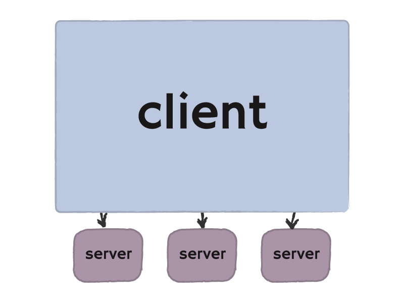
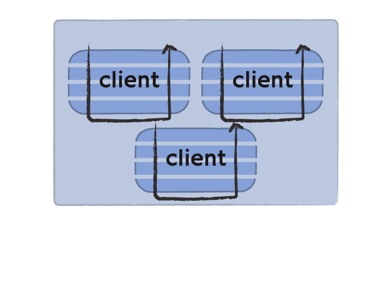

# rest-core <small><small>A modular Ruby REST client collection/infrastructure.</small></small>

---

# Who am I?

* Programmer at [Cardinal Blue Software][]
* Lin Jen-Shin ([godfat][])

[Cardinal Blue Software]: http://cardinalblue.com/
[godfat]: http://godfat.org/

---

* Web API
* Web Application as servers
* Web Application as clients
* Solution: [rest-core][]

[rest-core]: https://github.com/cardinalblue/rest-core

---

    (showing a lot of web service logo)
    (now we have so many web api)

---

    (showing a lot of tools' logo (e.g. ruby, http, html, etc))
    (we are building on top of others' work)

---

    (showing an image that someone stands op top of a soapbox,
     unsteady? or too high)
    (soap is so complex and hard to use)

---

    (lying on couch, see CouchDB's logo)
    (REST is so simple and straightforward)

---

# Web Application as servers

---

---

---

# Web Application as clients

---

# The History

---

# CGI (Common Gateway Interface)

---

# FastCGI

---

# SCGI (Simple CGI)

---

# Mongrel

---

# Rack (from WSGI)

---

     

---

* [WSGI][] (Python)
* [Rack][] (Ruby)
* [PSGI][] and [Plack][] (Perl)
* [Hack2][] / [WAI][] (Haskell)
* [JSGI & Jack][] (JavaScript)
* [Ring][] (Clojure)
* [EWGI][] (Erlang)
* [PHP Rack][] (PHP)

[WSGI]: http://wsgi.org/
[Rack]: http://github.com/rack/rack
[PSGI]: http://github.com/miyagawa/psgi-specs
[Plack]: http://github.com/miyagawa/Plack
[Hack2]: http://github.com/nfjinjing/hack2
[WAI]: https://github.com/yesodweb/wai
[JSGI & Jack]: https://github.com/tlrobinson/jack
[Ring]: http://github.com/mmcgrana/ring
[EWGI]: http://github.com/skarab/ewgi
[PHP Rack]: http://github.com/jimeh/php-rack

---

    

    !haskell

      (middleware (middleware (middleware app)))

---

   

    !haskell

      -- --> --> --> --> --> --> --> --> --> -->
      (middleware (middleware (middleware app)))
      -- <-- <-- <-- <-- <-- <-- <-- <-- <-- <--

---

# Composable and Reusable

---

# Why not do the same for Web Application as clients?

---

---

---

---

---

---

